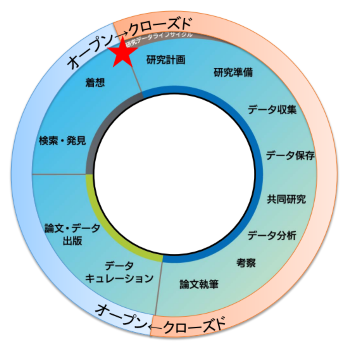

## NII RDC データガバナンス機能とは何か

### データガバナンス機能の概要

[データガバナンス機能の機能評価試験版サービス（以下、本サービス）のマニュアル](https://support.rdm.nii.ac.jp/usermanual/58)の「概要」セクションにも記載の通り、データガバナンス機能は、NII RDCを構成する機能の1つです。

データガバナンスとは、研究データを組織の知的資産としていかに生産し、保管し、利用していくかを統制（計画し、執行し、モニタリング）することです。データガバナンス機能では、以下のような研究サイクルの初めとなる研究計画およびデータ管理計画(Data Management Plan：DMP)の作成から論文やデータの公開まで、**研究計画に基づき研究者自身が研究プロジェクトのデータ管理の質を高めることを支援します**。また、研究プロセスに応じてNII RDCを構成する基盤や機能と連携することを計画しています。

具体的には、データガバナンス機能が提供するDMP作成機能、リサーチフロー機能、検証機能、研究記録機能によって研究データ管理品質の向上を支援します。DMP情報を活用することで、研究の個別性に対応し適切なリサーチフロー機能、検証機能を提供します。

### データガバナンス機能の目的

[本サービスのマニュアル](https://support.rdm.nii.ac.jp/usermanual/58)の「目的」セクションにも記載の通り、現在、研究データ管理（RDM）は研究者の裁量によります。RDM がうまく実践できていない場合、せっかく生成したデータがどこにあるか分からない、見つけたけれどそのデータが使い物になるのかどうか分からない、といった研究活動上の支障が発生しうるでしょう。**データガバナンス機能は研究者が RDM を実践する上である程度の RDM の方向性をつけられるような機能を提供し、研究者による RDM 実践を支援します**。

本ページを読み終えたら「[DG 機能評価試験版サービスとは何か](./02_dg_service.md)」に進みましょう。

## 移動用リンク

* [各種説明](./top.md)
