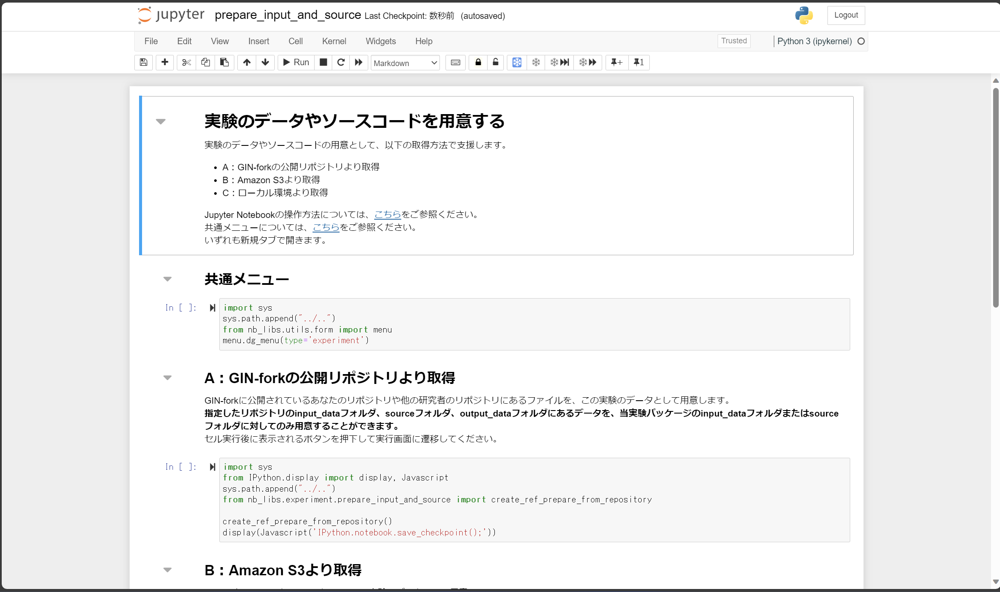
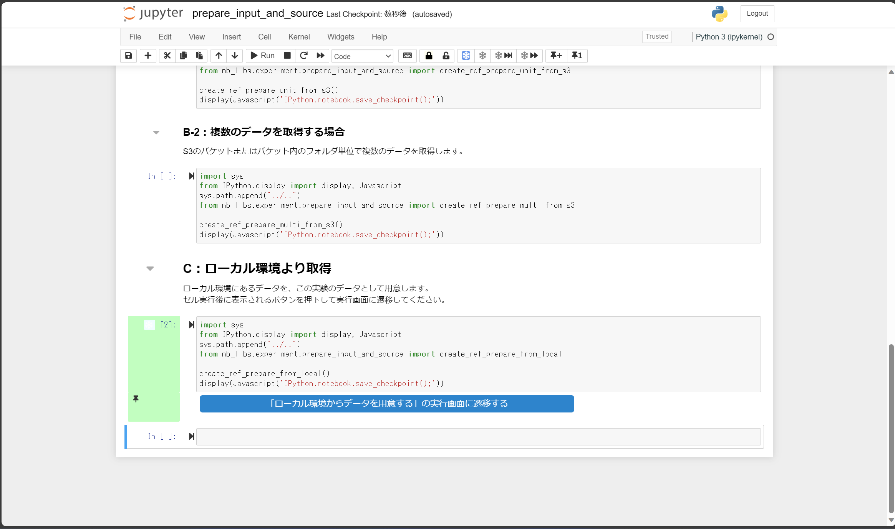
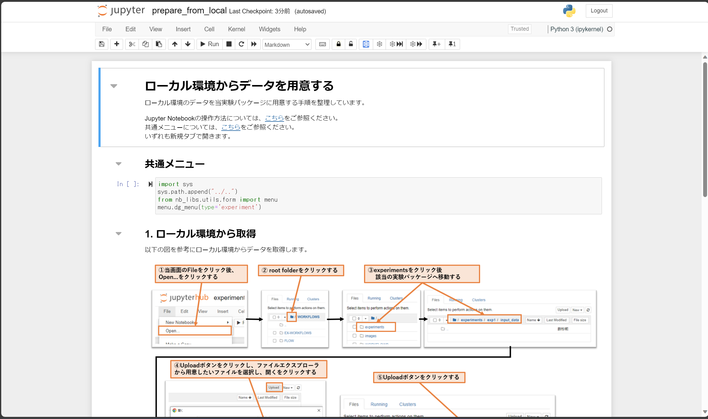

### 本実験を行う

本ステップでは、本チュートリアルが想定する研究テーマに沿って実験を行います。本ステップでは以下を体験していただきます。

* [「テスト実験を行う」](./carry_out_test_experiment.md)で学習した本サービスをりようする実験実行環境の構築～実験終了の操作を復習する。
* ローカル環境から実験実行環境へファイルをアップロードする。

本ステップで実践する手順を以下に示します。

1. [実験実行環境を構築する](#実験実行環境を構築する)
2. [実験用データをアップロードする](#実験用データをアップロードする)
3. [実験を実施する](#実験を実施する)
1. [実験の説明を記述する](#実験の説明を記述する)
1. [Snakefileに実験手順を記述する](#Snakefileに実験手順を記述する)
4. [実験結果を同期する](#実験結果を同期する)
5. [実験を終了し、実験実行環境を削除する](#実験を終了し、実験実行環境を削除する)

#### 本ステップを実施する前に

**本チュートリアルに基づき実施されている研究内で稼働中の実験実行環境がある場合、それらの環境上での作業と衝突する可能性があります**。それを避けるため、それらの環境を全て研究用リポジトリに同期したうえで停止し、削除しておくことをお勧めします。

#### 本ステップ実施中の留意事項

リサーチフロー用ノートブックで利用したいセルがフリーズされている場合は、それを unfreeze してご利用ください。

#### 実験実行環境を構築する

実験実行環境の構築手順は「テスト実験を行う」で実施した手順と同様です。以下を順に参照して実験実行環境の構築および初期セットアップを完了してください。

1. [テスト実験：実験実行環境を構築する](./carry_out_test_experiment.md#実験実行環境を構築する)
    * 今回は `01_main_experiment` を実験パッケージ名として設定します。
1. [テスト実験：実験の初期セットアップを行う](./carry_out_test_experiment.md#実験の初期セットアップを行う)

実験実行環境の初期セットアップまで完了したら、実験フロートップページに遷移します。

#### 実験用データをアップロードする

実験フロートップページにある実験フロー中の「実験のデータやソースコードを用意する」をクリックし、データ準備用のノートブック（下図）に遷移します。



共通メニューは適宜ご利用下さい。今回はローカル環境からデータをアップロードする手順を実施しますので、「C：ローカル環境より取得」セクションのセルを実行します。すると「『ローカル環境からデータを用意する』の実行画面に遷移する」ボタンが出現します（下図参照）。



このボタンをクリックし、ローカル環境からデータを用意するためのノートブック（下図）に遷移します。



ローカル環境からデータを取得手順が「1. ローカル環境から取得」セクションに示されています。それを参考にして、以下のファイルをアップロードします。

* `input_data` ディレクトリへアップロードするファイル：
    * [param.json](../../../data/02_basic/input_data/param.json)
    * [param_2.json](../../../data/02_basic/input_data/param.json)
* `source` ディレクトリへアップロードするファイル：
    * [01_simulation.ipynb](../../../data/02_basic/source/01_simulation.ipynb)
    * [02_normalization.ipynb](../../../data/02_basic/source/02_normalization.ipynb)
    * [03_calculate_exp_data.ipynb](../../../data/02_basic/source/03_calculate_exp_data.ipynb)
    * [04_simulate_delay_time.ipynb](../../../data/02_basic/source/04_simulate_delay_time.ipynb)
    * [05_arrange_data.ipynb](../../../data/02_basic/source/05_arrange_data.ipynb)

上記ファイルのアップロードが完了したら、「2. 作業ログメッセージの入力」セクションのセルを実行します。現れたフォームに以下のログメッセージを残し、「入力完了」ボタンをクリックします。

```markdown
upload data for a tutorial
```

後はセクション 3 ~ 5 を順番実行します。その後実験フロートップページに遷移します。

#### 実験を実施する

Jupyter Noteboo を開き、前のセクションでアップロードしたファイルを以下の順に実行します。

1. `01_simulation.ipynb`
    * FCC 球状結晶の (111) 面からの Bragg スポットを計算します。
    * **このノートブック内のセルを全て実行するのに一時間弱かかります**。
1. `02_normalization.ipynb`
    * `01_simulation.ipynb` で計算された結晶のうち最大サイズのもの（定常状態相当）からの Bragg スポット強度を基準にして、各結晶からの Bragg スポット強度を規格化します。
1. `03_calculate_exp_data.ipynb`
    * 実験により近い結果になるように、疑似的にポアソンノイズおよび検出器ノイズを規格化された Bragg スポットに付加します。
1. `04_simulate_delay_time.ipynb`
    * NIR 照射後の遅延時間を疑似的に計算します。
1. `05_arrange_data.ipynb`
    * 各結晶について、上記 4 つの計算結果をま一つの HDF5 ファイルにまとめます。

#### 実験結果を同期する

この操作は[「テスト実験を行う」における「実験結果を研究用リポジトリに同期する」](./carry_out_test_experiment.md#実験結果を研究用リポジトリに同期する)セクションでの操作と同様です。前節の各ノートブック実行ごとに途中結果を同期するのが良いでしょう。コミットメッセージは例えば次のように与えます。

|ノートブック|ログメッセージ|
|:---|:---|
| `01_simulation.ipynb` | `simulate Bragg spots from nanocrystals` |
| `02_normalization.ipynb` | `normalize Bragg spot intensity` |
| `03_calculate_exp_data.ipynb` | `add noise to Bragg spot intensity` |
| `04_simulate_delay_time.ipynb` | `simulate delay time of each nanocrystal` |
| `05_arrange_data.ipynb` | `arrange the simulative results` |

なお、同期するデータのサイズが大きいほど、または同期するデータの数が多いほど、同期にかかる時間が長くなります。

#### 実験の説明を記述する

この操作は[「テスト実験を行う」における「実験の説明を記述する」](./carry_out_test_experiment.md#実験の説明を記述する)セクションでの操作と同様です。説明文の一例を「[README.md](../../../data/02_basic/docs/README.md) 」に示します。

#### Snakefileに実験手順を記述する

この操作は[「テスト実験を行う」における「Snakefileに実験手順を記述する」](./carry_out_test_experiment.md#実験結果を研究用リポジトリに同期する)セクションでの操作と同様ですSnakefileの一例を「[Snakefile](../../../data/02_basic/docs/Snakefile)」に示します。

#### 実験を終了し、実験実行環境を削除する

この操作は[「テスト実験を行う」における「実験を終了し、実験実行環境を削除する」](./carry_out_test_experiment.md#実験を終了し、実験実行環境を削除する)セクションでの操作と同様です。

#### まとめ

本ステップでは以下を体験していただきつつ、[本章が扱う研究テーマ](./top.md#本章が扱う研究テーマ)に沿って X 銭広角散乱信号の模擬データを生成しました。

* [「テスト実験を行う」](./carry_out_test_experiment.md)で学習した本サービスをりようする実験実行環境の構築～実験終了の操作を復習する。
* ローカル環境から実験実行環境へファイルをアップロードする。この操作において、本サービスはアップロードされたデータを研究用リポジトリに同期して管理することを実現します。

本ステップを完了したら[次のステップに進みましょう](./validate_metadata.md)。
