### 論文を執筆する

本ステップでは実験・解析結果を基に、論文の執筆を行います。

本ステップで実践する手順を以下に示します。

1. [論文執筆環境を構築する](#論文執筆環境を構築する)
1. [論拠データを選別する](#論拠データを選別する)
1. [草稿を作成する](#草稿を作成する)
1. [論文を執筆する](#論文を執筆する)
1. [論文のメタデータを登録する](#解析の説明を記述する)
1. [投稿先を選定する](#投稿先を選定する)

#### 論文執筆環境を構築する

「メインメニューを表示」のコードセルを実行し、メインメニューを表示します。

| 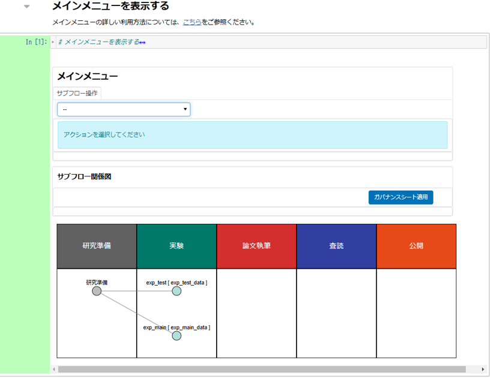 |
|---|

「サブフロー操作」下部のプルダウンから、「サブフロー新規作成」を選択します。

サブフローの詳細設定を行います。本チュートリアルでは以下のように入力します。

|項目名|値|
|:---|:---|
| サブフロー種別 | 論文執筆（プルダウンから選択） |
| サブフロー名称 | paper_test |
| データディレクトリ名 | paper_data |
| 親サブフロー種別 | 実験（プルダウンから選択） |
| 親サブフロー選択 | （「exp_main」をクリック） |

設定項目をすべて入力後、「＋新規作成」をクリックします。

| 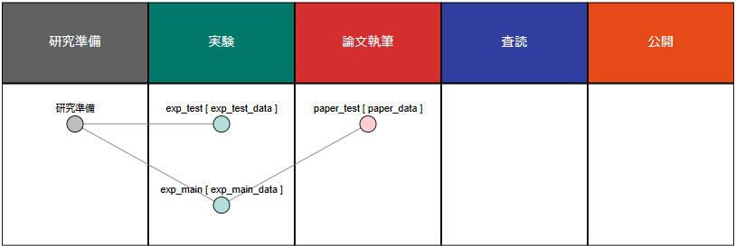 |
|---|

「サブフロー関係図」の「論文執筆」にあるをクリックし、論文執筆サブフローメニューに遷移します。

|  |
|---|

研究準備や実験と同様に、背景が黄色となっているフロー図に従って操作を行います。

| 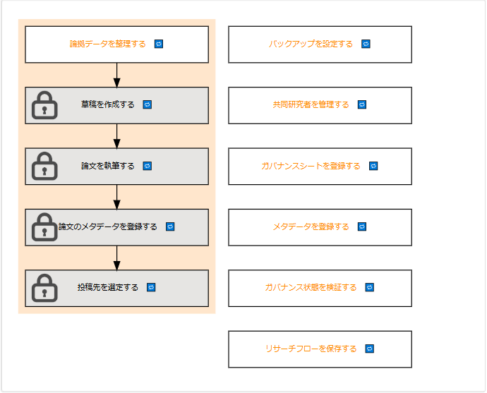 |
|---|

#### 論拠データを整理する

論文執筆サブフローメニューにあるフロー中の「論拠データを整理する」をクリックし、論拠データ整理用のノートブックに遷移します。

| 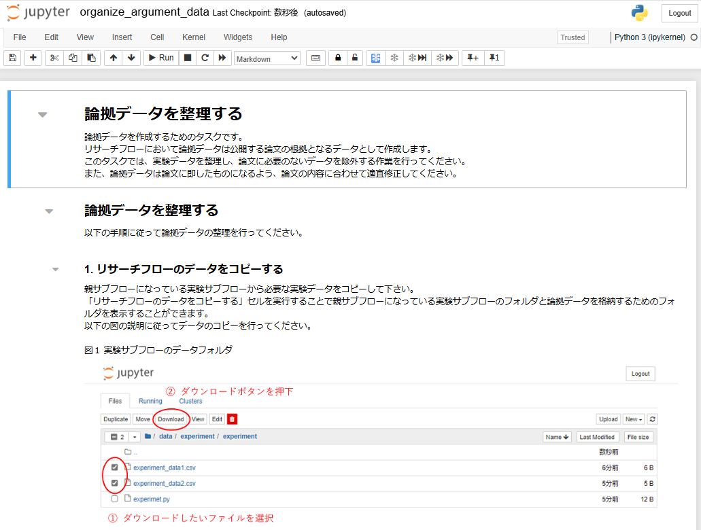 |
|---|

「リサーチフローのデータをコピーする」コードセルを実行します。
親サブフローになっている実験サブフローと論拠データを格納するフォルダを表示するボタンが表示されます。
まずは、実験サブフローのデータフォルダを表示します。

| 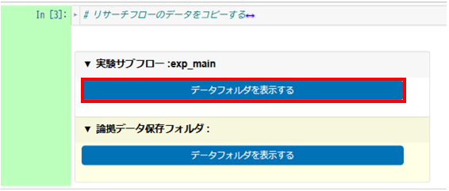 |
|---|

表示されたフォルダの中から必要なファイルをダウンロードします。

| 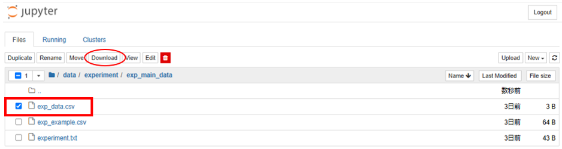 |
|---|

ダウンロードが完了したら、論拠データ保存フォルダを表示します。

| 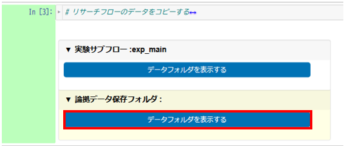 |
|---|

ダウンロードしたファイルを「Upload」ボタンからアップロードします。

| 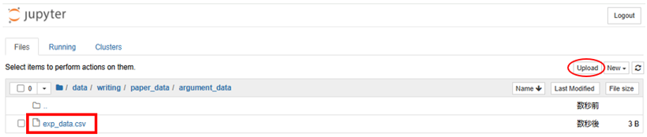 |
|---|

アップロードが完了したら、コピーしたデータを整理します。
「コピーしたデータを整理する」コードセルを実行して下さい。
実行後、表示されるボタンを押下し、アップロードした論拠データのフォルダ構成や名前の編集、不要なデータの削除を行い、論拠データを論文に即したものに整理してください。

|  |
|---|

整理が完了したら、「メタデータを登録するタスクへアクセスするボタンを表示する」コードセルを実行して下さい。
実行すると、「メタデータ登録」タスクにアクセスするボタンが表示されるのでクリックしてメタデータ登録を行ってください。

| 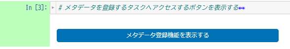 |
|---|

メタデータ登録を行った後、本ノートブックに戻り、「検証するタスクへアクセスするボタンを表示する」コードセルを実行して下さい。
実行すると、「ガバナンス状態を検証する」タスクにアクセスするボタンが表示されるのでクリックして論拠データのメタデータの検証を行ってください。

| 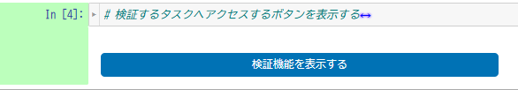 |
|---|

検証を行った後、本ノートブックに戻り、「文献データフォルダを表示する」コードセルを実行してください。
実行後、表示されるボタンを押下し、文献用のフォルダを表示します。
表示されたフォルダ内に収集した文献を整理してアップロードしてください。
また、参考文献は論文に即したものになるよう適宜編集をしてください。

| 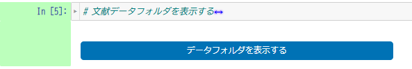 |
|---|

文献のアップロードが完了したら、「GakuNin RDMに保存する」コードセルを実行してください。

| 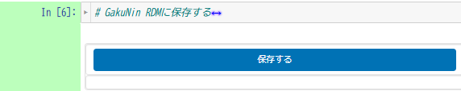 |
|---|

テキストボックスが表示された場合、パーソナルアクセストークンを入力し、「保存する」クリックします。

「GakuNin RDMへの同期が完了しました。」が表示されたら同期成功です。
※同期完了まで10分～15分程度時間がかかります。

同期完了後、「サブフローメニューを表示する」のセルを実行し、サブフローメニューへ遷移します。

サブフロー図の「論拠データを整理する」に青いチェックマークがついていることを確認します。
また、「草稿を作成する」、「論文を執筆する」が実行可能になっていることを確認します。

| 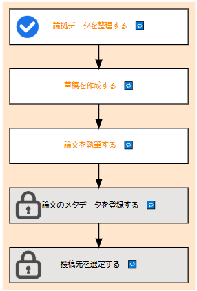 |
|---|

#### 草稿を作成する

サブフロー図中の「草稿を作成する」をクリックします。

| 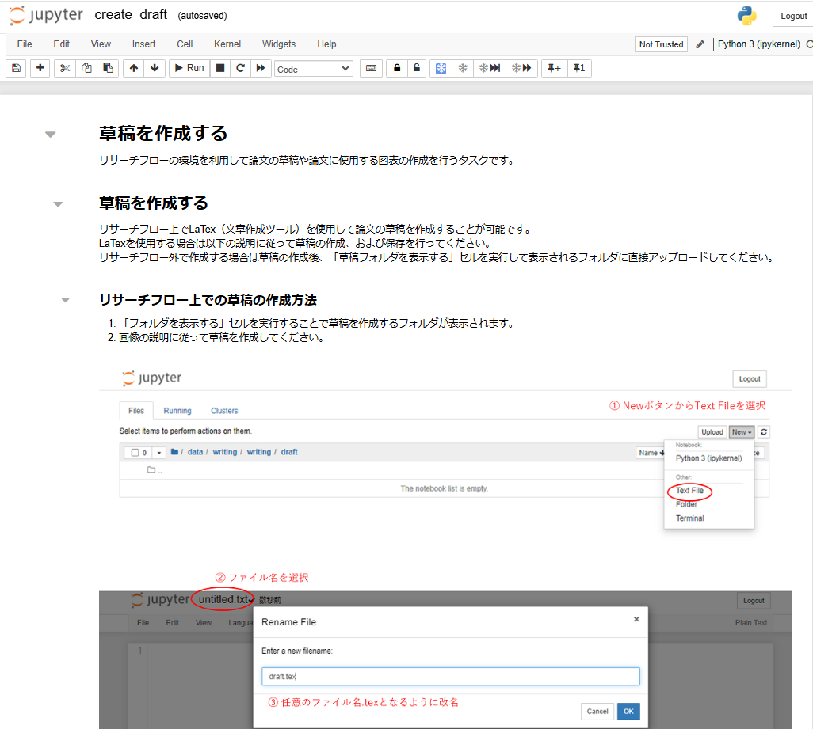 |
|---|

リサーチフロー上でLaTexを使用して論文の草稿を作成することができます。
LaTexを使用しない場合はリサーチフロー外で草稿を作成した後、「草稿フォルダを表示する」コードセルを実行して表示されるボタンをクリックし、表示されるフォルダに直接アップロードしてください。

リサーチフロー上で草稿を作成する場合は「草稿フォルダを表示する」コードセルを実行し表示されるボタンをクリックします。

| 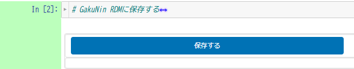 |
|---|

フォルダが表示されたら「New」→「Text File」とクリックします。

| 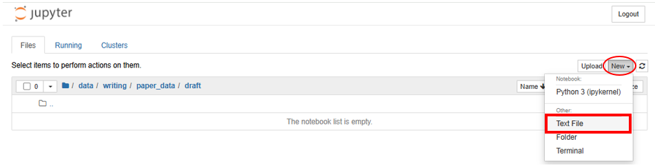 |
|---|

クリックするとテキストファイルが新規作成されます。
作成されたらuntitled.txtとなっているファイル名を「任意のファイル名.tex」となるように変更します。

| 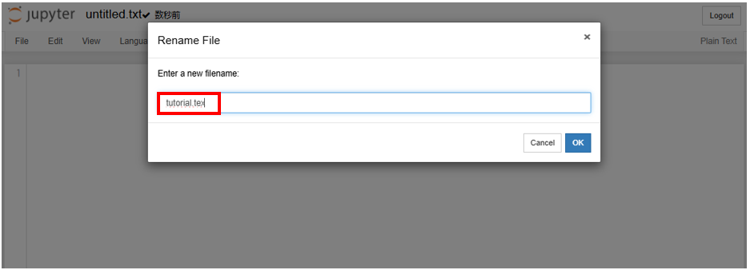 |
|---|

草稿を編集したら必ず保存してからファイルを閉じるようにしてください。

草稿の編集が完了したら、PDFとして出力します。
本チュートリアルではセル実行でPDF化を行います。
「texファイルをPDFとして出力する」セルにファイル名を入力し実行します。

| 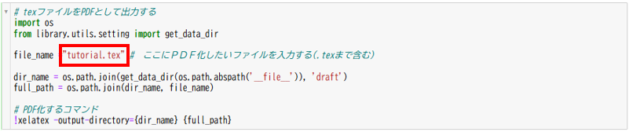 |
|---|

同じフォルダ内にPDFが出力されます。

| 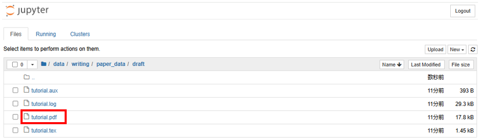 |
|---|

また、セル実行ではなくterminalで「xelatex {対象ファイルまでのパス}」を実行することでPDF化することも可能です。

草稿をPDFで出力したら、続いて図表を作成します。
図表もリサーチフロー上で作成することができます。
新しい図表を作成する場合は「図表を新たに作成する」セルを実行し任意のノートブック名を入力後、作成ボタンをクリックし図表作成用のノートブックを作成してください。

| 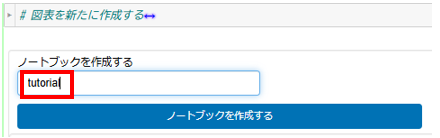 |
|---|

作成したら、「ノートブックを作成する」ボタンが「ノートブックを表示する」ボタンに変わるのでクリックします。

| 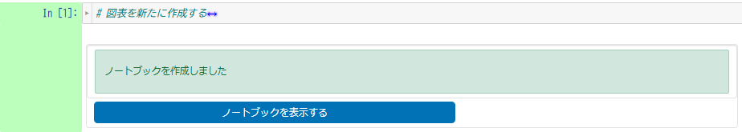 |
|---|

クリックすると図表作成用のノートブックが開きます。

| 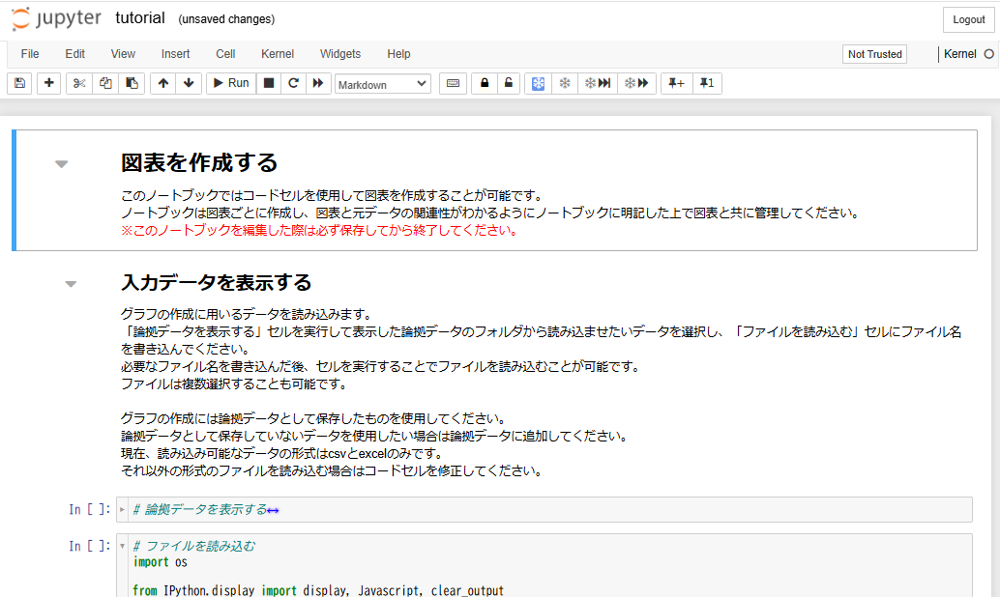 |
|---|

#### 図表を作成する

「ファイルを読み込む」セルにファイル名を入力し実行します。
本チュートリアルでは「exp_data.csv」と入力します。

| 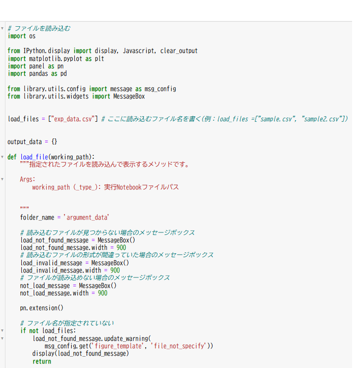 |
|---|

読み込んだファイルの表を「コードセルで作成する」セルを実行して作成します。

| 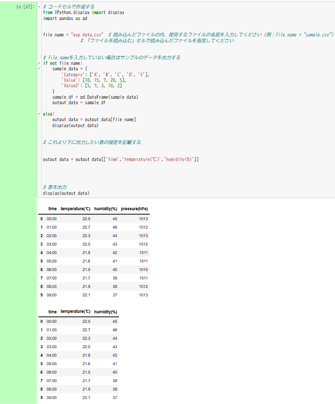 |
|---|

2つ表が表示されますが2つ目は表示設定をしたものになります。
本チュートリアルでは以下のように設定しています。

| 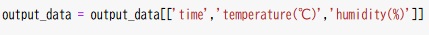 |
|---|

「表を保存する」セルを実行して作成した表を保存します。
表は拡張子pngの画像ファイルで「sample.png」で保存されます。
ファイル名と拡張子の変更をする場合はセル内のコードを書き換えてください。

| 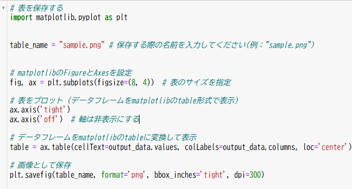 |
|---|

| 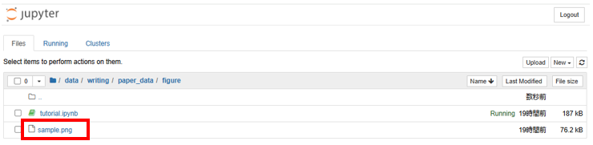 |
|---|

次にグラフの作成をします。
「コードセルで作成する」セルを実行してください。

| 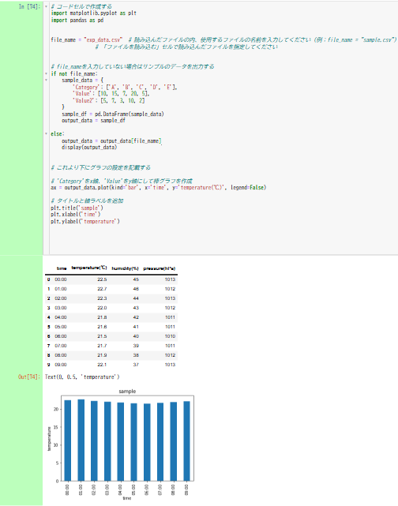 |
|---|

作成出来たらそのグラフを「グラフを保存する」セルを実行して保存します。
グラフは拡張子pngの画像ファイルで「sample_graph.png」で保存されます。
ファイル名と拡張子の変更をする場合はセル内のコードを書き換えてください。

| 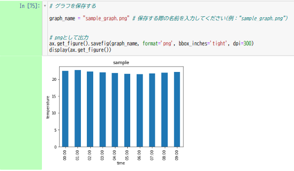 |
|---|

| 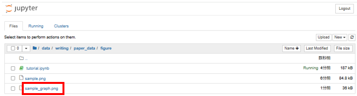 |
|---|

また、既に作成した図表の編集を行いたい場合は以下の手順で行います。
1. 「図表フォルダを表示する」セルを実行して表示されるボタンをクリックします。

| 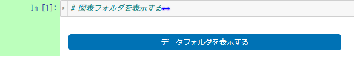 |
|---|

2. 図表と図表生成用のノートブックが保存されているフォルダから編集したい図表、またはノートブックを開いて編集してください。

| 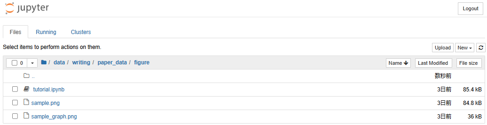 |
|---|

リサーチフローを使わずに図表を作成した場合は以下の手順で行います。
1. 「図表フォルダを表示する」セルを実行して表示されるボタンをクリックします。

|  |
|---|

2. 「Upload」ボタンから作成した図表をアップロードしてください。

| 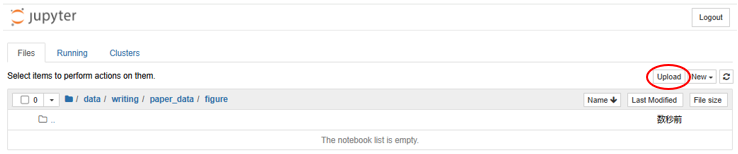 |
|---|

アップロードが完了したら、Gakunin RDMに保存する前に執筆における注意事項を確認してください。

| 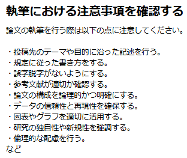 |
|---|

確認したら「GakuNin RDMに保存する」セルを実行します。

|  |
|---|

テキストボックスが表示された場合、パーソナルアクセストークンを入力し、「保存する」をクリックします。

「GakuNin RDMへの同期が完了しました。」が表示されたら同期成功です。
※同期完了まで10分～15分程度かかります。

同期完了後、「サブフローメニューを表示する」セルを実行し、サブフローメニューへ遷移します。

サブフロー図の「草稿を作成する」に青いチェックマークがついていることを確認します。

| 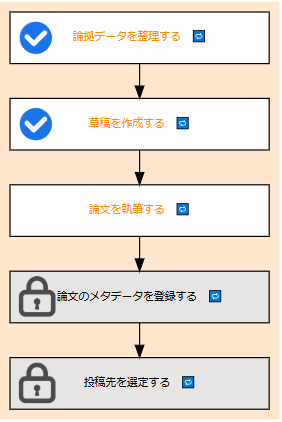 |
|---|

#### 論文を執筆する
サブフロー図中の「論文を執筆する」をクリックします。

| 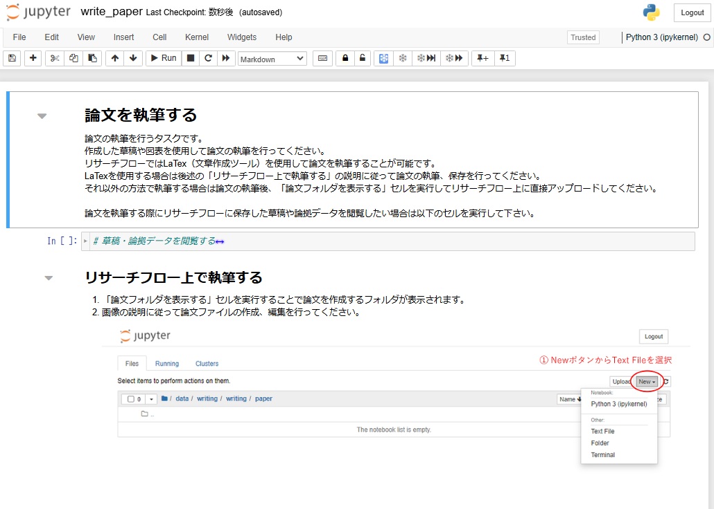 |
|---|

論文の執筆も草稿の作成と同じようにリサーチフロー上でLaTexを使用し作成することができます。
リサーチフローに保存した草稿や論拠データを閲覧したい場合は「草稿・論拠データを閲覧する」セルを実行してください。
リサーチフロー上で論文を執筆する場合は「論文フォルダを表示する」セルを実行し、表示されるボタンをクリックします。
フォルダが表示されたら[草稿を作成する](#草稿を作成する)と同じようにリサーチフロー上でLaTexを使用して作成することができます。
必要であれば論文に必要な図表を作成してください。作成手順は[図表を作成する](#図表を作成する)を参照してください。

論文の執筆が完了したら、「GakuNin RDMに保存する」のセルを実行します。

|  |
|---|

テキストボックスが表示された場合、パーソナルアクセストークンを入力し、「保存する」をクリックします。

「GakuNin RDMへ同期が完了しました。」が表示されたら同期成功です。
※同期完了まで10～15分程度時間がかかります。

同期完了後、「サブフローメニューを表示する」セルを実行し、サブフローメニューへ遷移します。

サブフロー図の「論文を執筆する」に青いチェックマークがついていることを確認します。

| 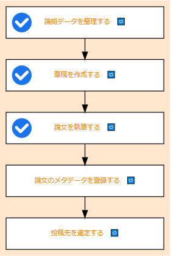 |
|---|

#### 論文のメタデータを登録する

#### 投稿先を選定する

#### まとめ

<!-- まとめ -->

本ステップを完了したら[次のステップに進みましょう](./publish_paper.md)。
