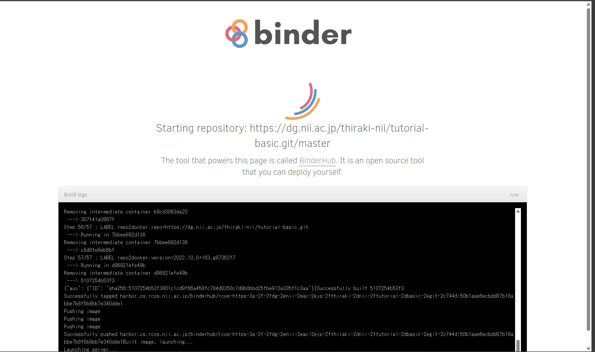
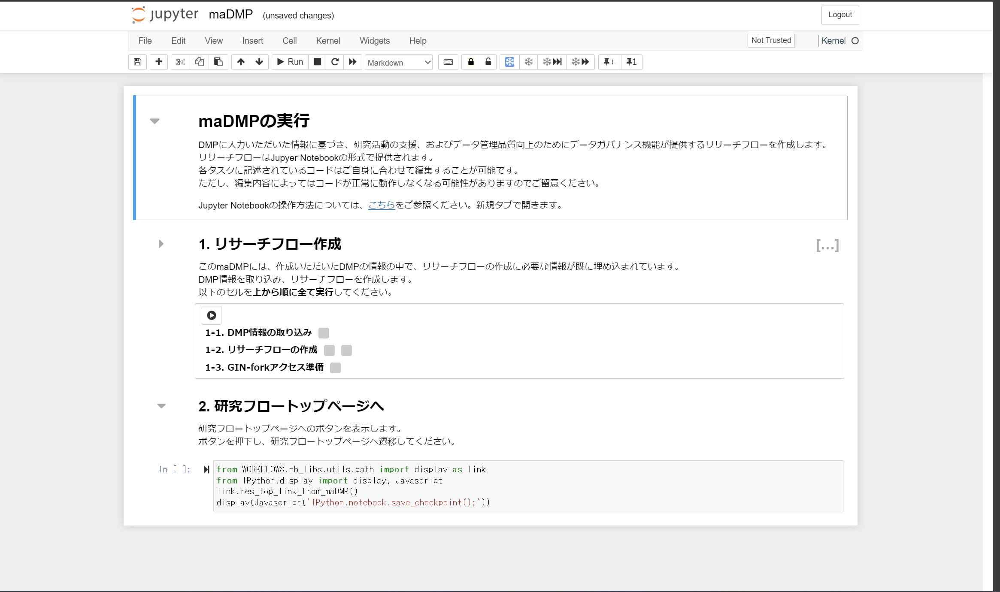
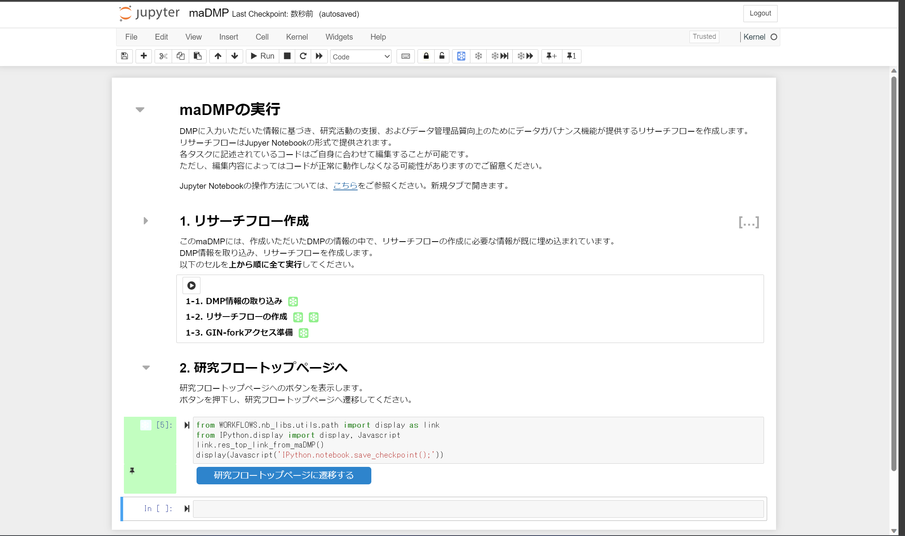
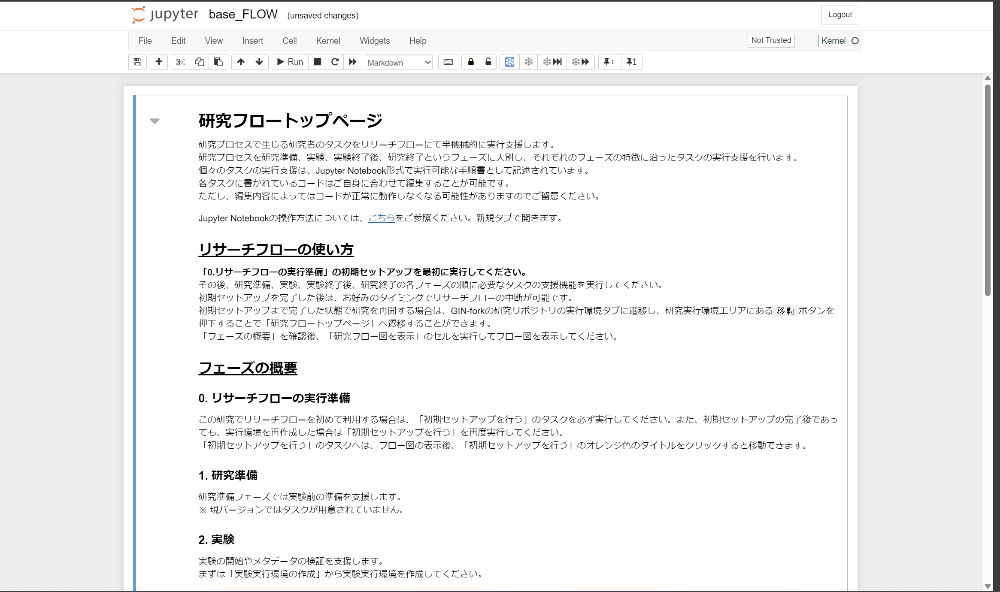
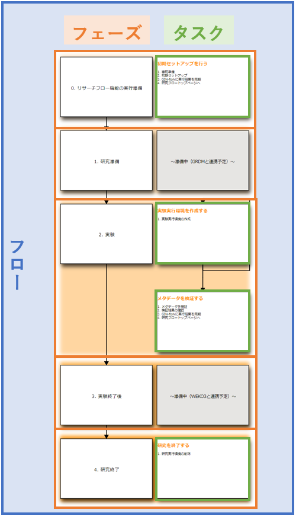
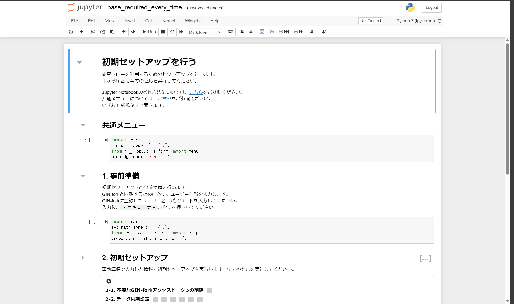
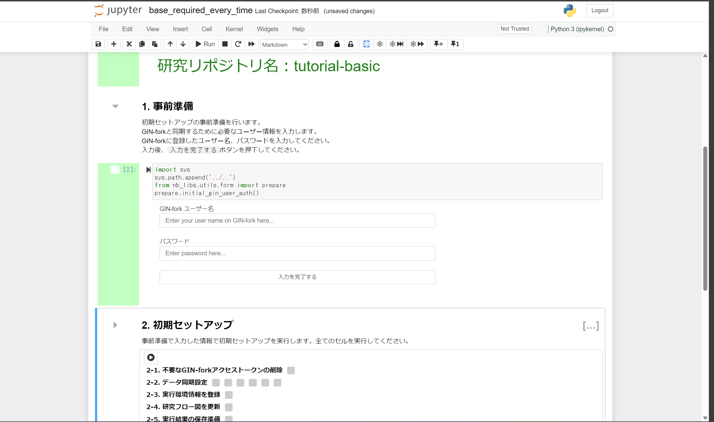
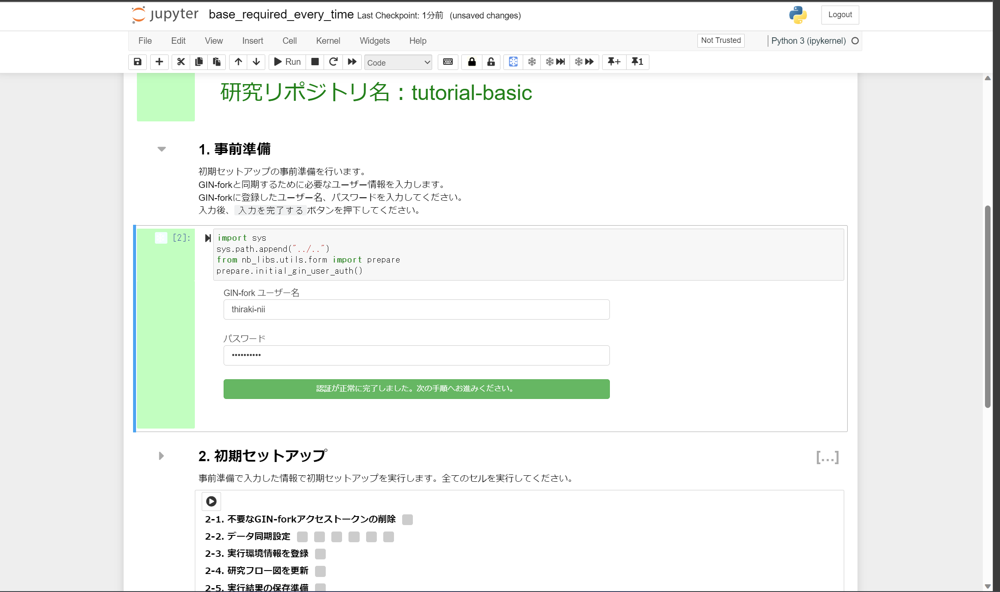
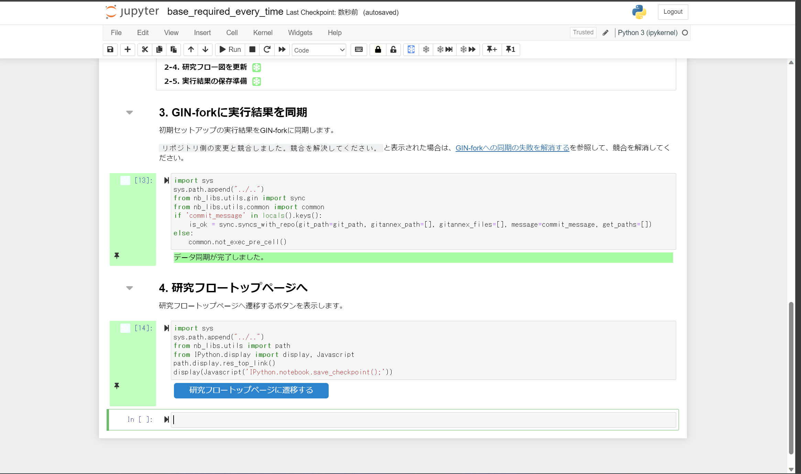
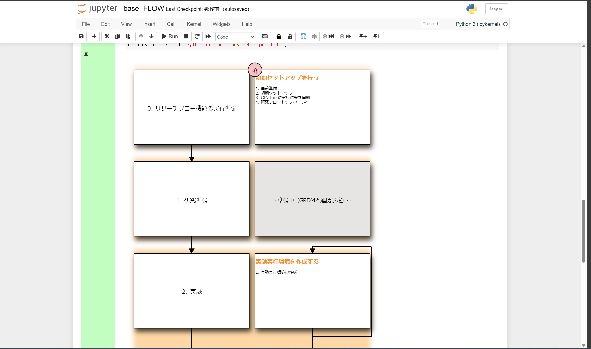

### 研究実行環境を構築する

本ステップでは[前のステップ](./create_research_env.md)で生成された maDMP を利用して研究実行環境の構築および初期設定を行います。本ステップで実践する手順を以下に示します。

1. [研究実行環境を構築する](#研究実行環境を構築する)
1. [MaDMPを実行する](#MaDMPを実行する)
1. [研究実行環境の初期セットアップを行う](#研究実行環境の初期セットアップを行う)

#### 本ステップで体験していただくこと

* (Ma)DMP に基づき GRDM のコード付帯機能を利用する研究実行環境の構築。

#### MaDMPを基に研究実行環境を構築する

研究用リポジトリのトップページにある「container list」をクリックし、コンテナリストのページに遷移します。MaDMP 作成後は下図に示されるようなページが表示されるはずです。

「container list」ページにて「container.madmp」ボタンをクリックします。それにより、GRDM のコード付帯機能を利用して研究実行環境の構築が開始します。このとき下図のように、構築状況を確認できるページがブラウザの別タブで開き、そのタブに自動的に遷移します。研究実行環境の構築には 5 ~ 10 分かかることがあります。

研究実行環境が構築されると、研究実行環境内の Jupyter Notebook にて `maDMP.ipynb` が開かれます（下図）。

#### MaDMPを実行する

`maDMP.ipynb` には以下の手順が実装されています。

1. DMP 情報の取り込み。DMP 中の以下の情報を研究実行環境に取り込みます。
    * workflowIdentifier
    * contentSize
    * datasetStructure
    * useDocker
1. リサーチフローの作成
1. GIN-fork アクセス準備

前節の最後に開かれた `maDMP.ipynb` のページにて上から順にセルを実行することで処理が進みます。セルの実行方法は Jupyter Notebook における通常のセルの実行方法と同じです。全てのセルの実行が完了すると下図のようになります。

ページの下方に出力される「研究フロートップページに遷移する」をクリックし、リサーチフローの研究フロートップページ（下図）に遷移します。

2023/8/30 時点で、研究フロートップページは以下の二つの操作に対応するセルで構成されます。

* 共通メニュー。このセルを実行することで以下の二つの操作を行うプルダウンメニューが表示されます。
    * 研究リポジトリ名を確認する。研究リポジトリ名が表示されます。
    * GIN-fork に遷移する。研究用リポジトリに遷移します。
* 研究フロー図。主にこちらを使用します。

このページでもセルを上から実行するだけで処理が進みます。セルの実行が完了すると、ページ中に下図のような研究フロー図が表示されます。

#### 研究実行環境の初期セットアップを行う

研究フロートップページに表示される研究フロー図にて「初期セットアップを行う」をクリックし、初期セットアップ用ノートブック（下図）に遷移します。

初期セットアップ用ページでの操作は以下の二つです。

1. 上から順にセルを実行する。
1. 研究用リポジトリへの同期のためのGIN-forkアカウント情報を入力する。

このセットアップにより、研究用リポジトリの container list に研究実行環境が追加されます。それでは上から順にセルを実行しましょう。途中で下図のようにアカウント情報を求められますので、手動で入力して「入力を完了する」ボタンをクリックしてください。

入力されたアカウント情報に基づき認証が成功すると下図のようにボタンの表示が変わります。

残りのセルを上から順に全て実行します。最後のセルの実行結果に「研究フロートップページに遷移する」ボタンが表示されます（下図）。このボタンをクリックして研究フロートップページに遷移します。

研究フロートップページにて研究フロー図を更新すると、研究フロー図中の「初期セットアップを行う」に「済」の印が付きます（下図）。

#### まとめ

本ステップでは研究実行環境を構築する方法を試しました。自身で同じことをしようとすると、秘密鍵の設定やら git コマンドの利用やらの手間がかかります。本サービスではそれらを自動化し、ユーザーの操作を簡便化（少しの入力とボタンクリックのみ）しております。

本ステップを完了したら[次のステップに進みましょう](./carry_out_test_experiment.md)。
