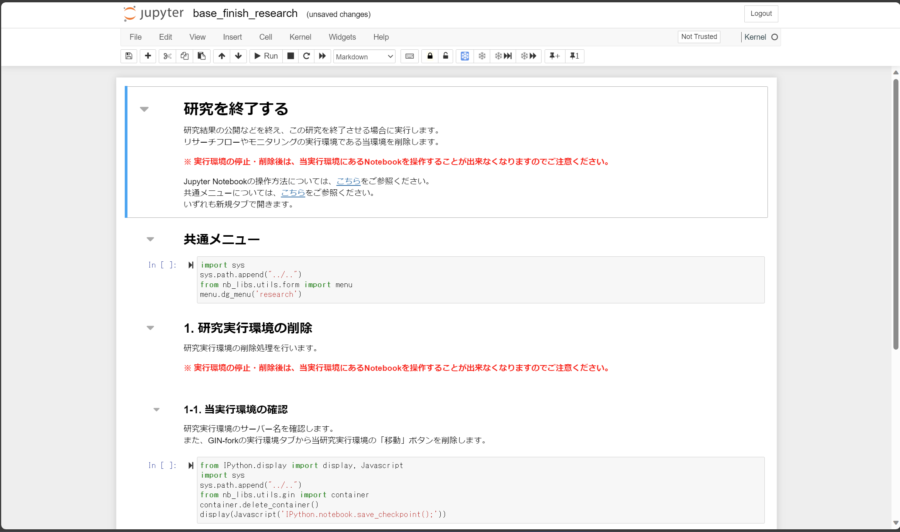

### 研究を終了する

基本編の最後のステップとして、本サービスでの研究終了時に研究実行環境の設定を保存して研究実行環境を削除する手順を実践します。実験を終了する時と同じように、研究を実施した環境（つまり研究実行環境）の構成に関する情報を保存してから研究実行環境を削除します。この操作もボタンクリックと少しの画面遷移のみで完結します。

まずは研究フロートップページに遷移します。研究フロー図中の「研究を終了する」をクリックし、研究終了用ノートブック（下図）に遷移します。

そのノートブック中のセルを上から順に実行します。最後のセルの実行後に研究実行環境に対応するタグが表示されます。JupyterHub のサーバー管理画面からこのタグに対応する環境を選択し、stop & delete を実行します。これにより研究実行環境が削除されます。

#### まとめ

本ステップでは研究実行環境の情報を保存し、研究実行環境を削除する方法を試しました。本ステップのポイントは以下の通りです。

* 本サービスを利用すると、ボタンクリックと少しの画面遷移のみで研究実行環境が削除できる。

本ステップを完了したら次のいずれかに進みましょう。

* [基本編のまとめ](../summary.md)
