### 論文を公開する

本ステップでは論文の公開を行います。

本ステップで実践する手順を以下に示します。
1. [論文公開環境を構築する](#論文公開環境を構築する)
1. [公開データを整理する](#公開データを整理する)
1. [データキュレーションをする](#データキュレーションをする)
1. [公開先の規定に適合することを確認する](#公開先の規定に適合することを確認する)
1. [データを公開する](#データを公開する)

#### 論文公開環境を構築する

「メインメニューを表示」のコードセルを実行し、メインメニューを表示します。

| 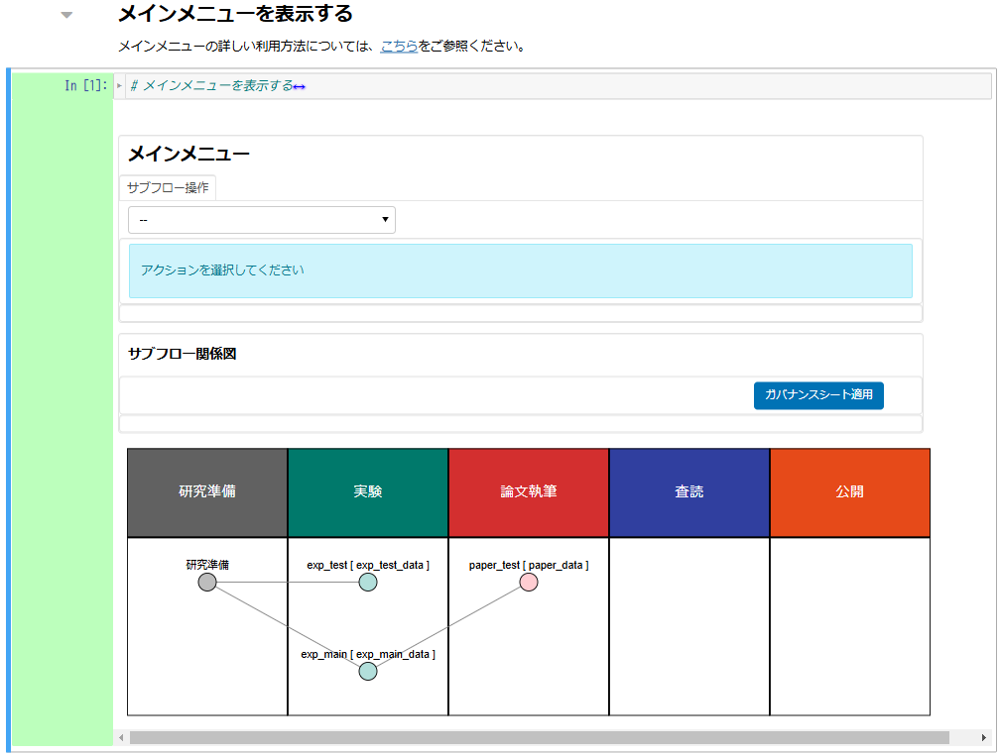 |
|---|

「サブフロー操作」下部のプルダウンから、「サブフロー新規作成」を選択します。

サブフローの詳細設定を行います。本チュートリアルでは以下のように入力します。

|項目名|値|
|:---|:---|
| サブフロー種別 | 公開（プルダウンから選択）|
| サブフロー名称 | publish_test |
| データディレクトリ名 | publish_data |
| 親サブフロー選択 | 論文執筆（プルダウンから選択）|
| 親サブフロー選択 | （「paper_test」をクリック）|

設定項目をすべて入力後、「＋新規作成」をクリックします。

| 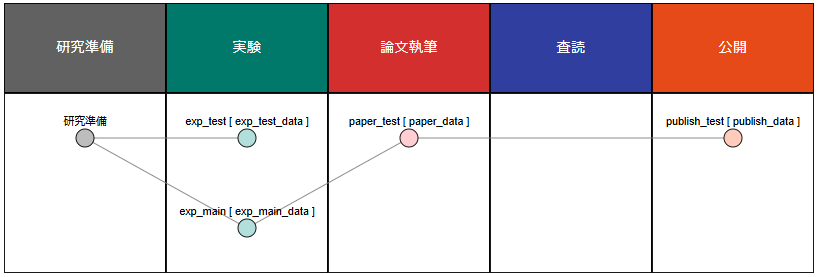 |
|---|

「サブフロー関係者」の「公開」にあるをクリックし、公開サブフローメニューに遷移します。

| 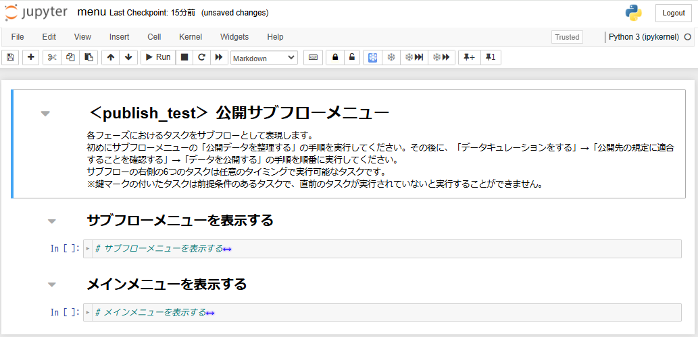 |
|---|

これまでと同様に、背景が黄色となっているフロー図に従って操作を行います。

| 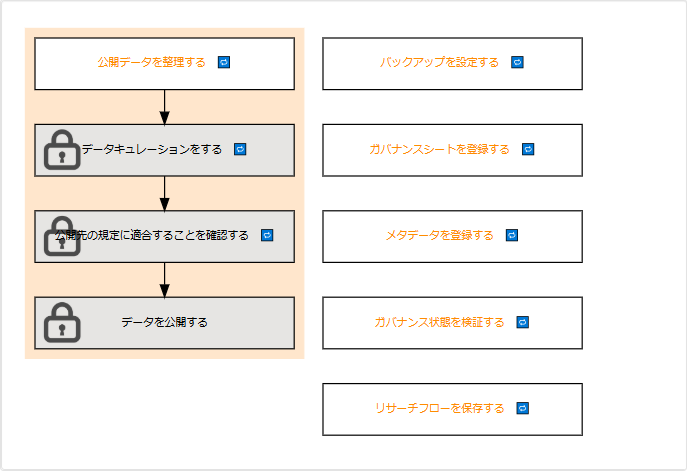 |
|---|

#### 公開データを整理する
公開サブフローメニューにあるフロー中の「公開データを整理する」をクリックします。

| 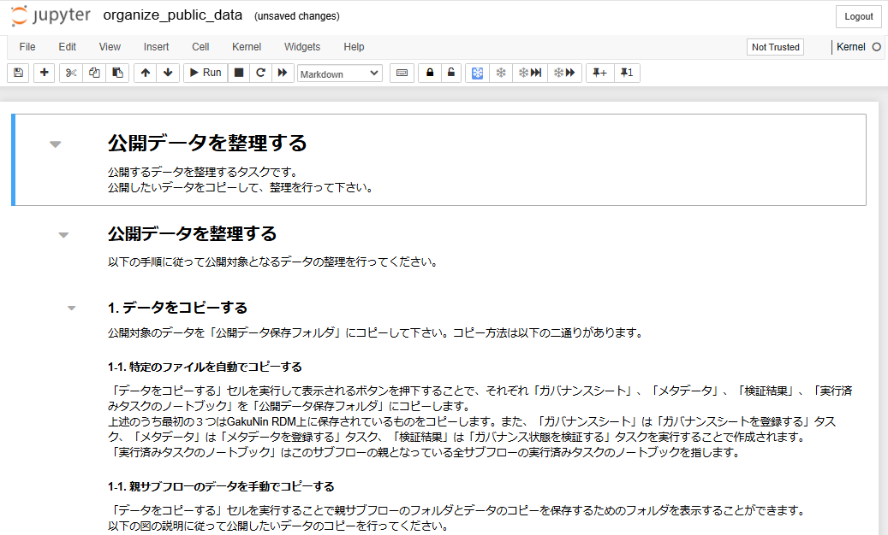 |
|---|

以下の手順に従って公開対象となるデータの整理を行ってください。

1. データをコピーする

公開対象のデータを「公開データ保存フォルダ」にコピーしてください。
「データをコピーする」セルを実行するとボタンが表示されます。
コピー方法は「研究データを自動でコピーする」と「研究データを手動でコピーする」の二通りがあります。
まずは、「研究データを自動でコピーする」を行います。

| 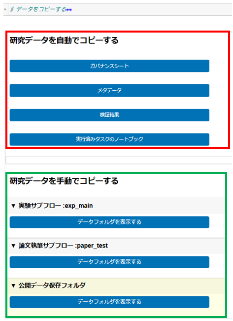 |
|---|

1-1. 研究データを自動でコピーする

表示されている「ガバナンスシート」、「メタデータ」、「検証結果」、「実行済みノートブック」ボタンをそれぞれ押下することで「公開データ保存フォルダ」にコピーすることができます。
「ガバナンスシート」は「ガバナンスシートを登録する」タスク、「メタデータ」は「メタデータを登録する」タスク、「検証結果」は「ガバナンス状態を検証する」タスクを実行することで作成されます。
「実行済みのノートブック」はこのサブフローの親となっている全サブフローの実行済みタスクのノートブックを指します。

1-2. 親サブフローのデータを手動でコピーする

表示されている「データフォルダを表示する」ボタンを押下することで親サブフローのフォルダ、公開データ保存フォルダを表示することができます。
まずは、親サブフローのフォルダを表示してコピーしたいデータを選択し、「Download」ボタンを押下してください。
本チュートリアルではPDF化した論文をダウンロードします。

| 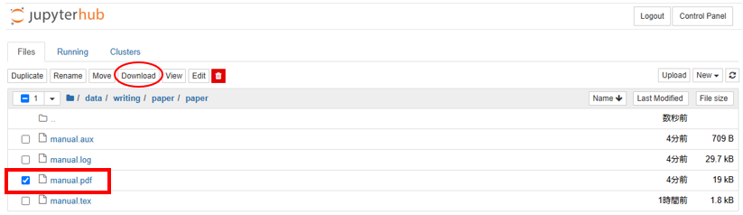 |
|---|

ダウンロードが完了したら、公開データ保存フォルダを表示します。
「Upload」ボタンを押下して、データをアップロードしてください。

| 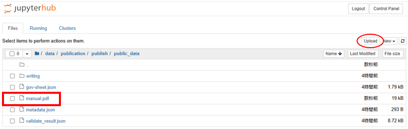 |
|---|

2. コピーしたデータを整理する
コピーしたデータを公開するのに適したデータとなるよう整理してください。
「公開データフォルダを表示する」セルを実行するとボタンが表示されるのでクリックします。
表示されたフォルダ内のデータを整理してください。

| 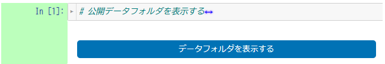 |
|---|

#### 公開データにメタデータを付与する
公開データのメタデータ登録を行ってください。
「メタデータを登録するタスクへアクセスするボタンを表示する」セルを実行すると「メタデータ登録機能を表示する」ボタンが表示されます。

|  |
|---|

ボタンをクリックして「メタデータを登録する」タスクでメタデータ登録を行ってください。
登録が完了したら、本ノートブックに戻り、「再現性を確認する」に進んでください。

#### 再現性を確認する
メタデータの検証と再現性の確認を行ってください。

※再現性を確認する機能は現在開発中です。

#### メタデータを検証する
論拠データのメタデータの検証を行ってください。
「検証するタスクへアクセスするボタンを表示する」セルを実行します。
ボタンが表示されるのでクリックして「ガバナンス状態を検証する」に進んでください。

|  |
|---|

検証が完了したら、本ノートブックに戻り、「GakuNin RDMに保存する」セルを実行してください。

|  |
|---|

テキストボックスが表示された場合、パーソナルアクセストークンを入力し、「保存する」をクリックします。

「GakuNin RDMへの同期が完了しました。」が表示されたら同期成功です。
※同期完了まで10分～15分程度時間がかかります。

同期完了後、「サブフローのフォルダを表示する」のセルを実行し、サブフローメニューへ遷移します。

サブフロー図の「公開データを整理する」に青いチェックマークがついていることを確認します。

| 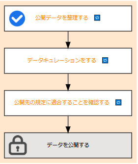 |
|---|

#### データキュレーションをする

#### 公開先の規定に適合することを確認する

#### データを公開する
公開サブフローメニューにあるフロー中の「データを公開する」をクリックします。

| 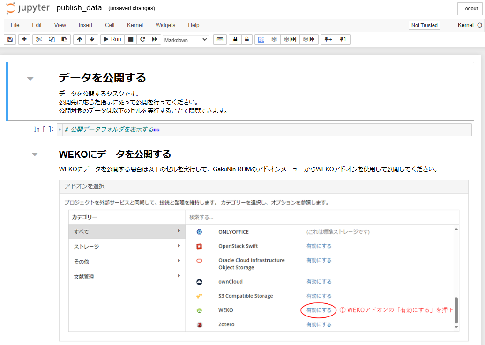 |
|---|

公開対象のデータを閲覧したい場合は「公開データフォルダを表示する」セルを実行し、表示されるボタンをクリックすることで閲覧できます。

「WEKOにデータを公開する」セルを実行します。
実行すると、「GakuNin RDMのアドオンメニューを表示する」ボタンが表示されるのでクリックします。

アドオンメニューが表示されるのでWEKOを有効にします。

| 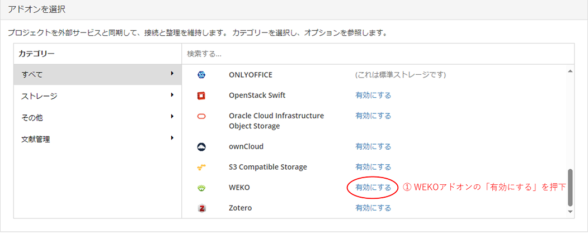 |
|---|

有効にすると以下のようになるのでアカウントに接続するをクリックします。

| 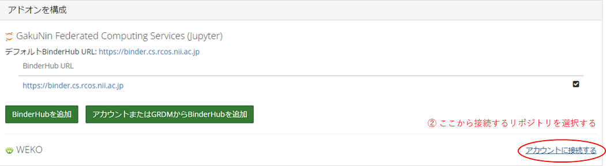 |
|---|

WEKOのリポジトリを選択する画面が表示されますので接続するリポジトリを選択して接続まで行ってください。

| 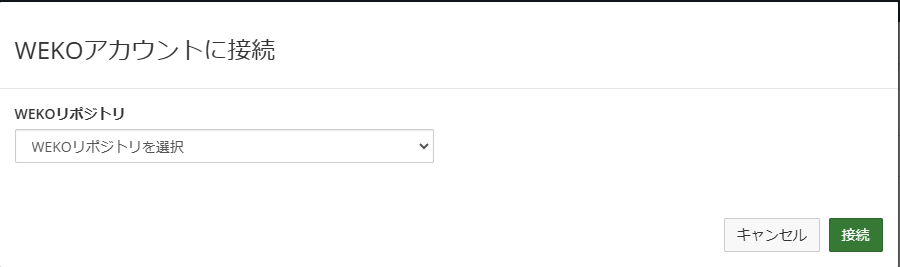 |
|---|

#### まとめ

<!-- まとめ -->

本ステップを完了したら[次のステップに進みましょう](./finish_research.md)。